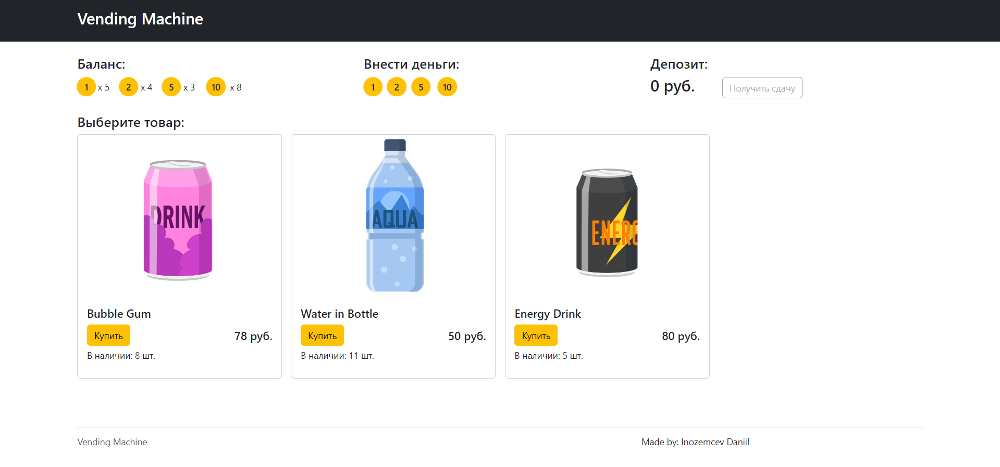
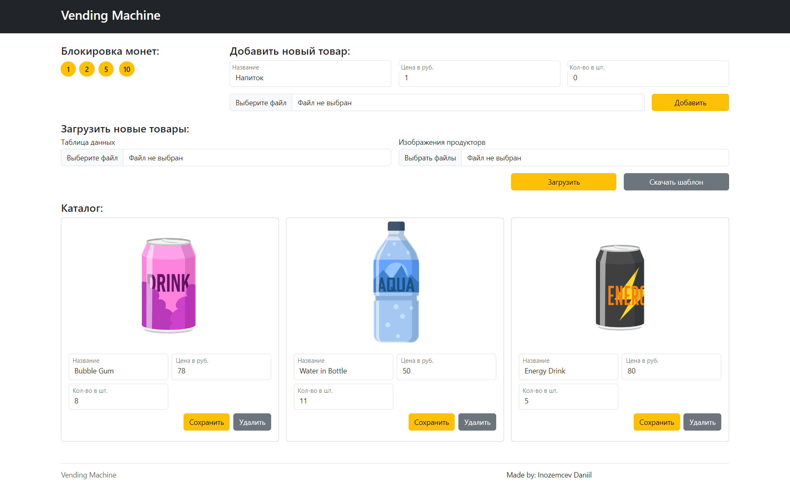

# Проект "Vending Machine"

Данное веб-приложение имитирует работу автомата по продаже напитков и других продуктов.
## Используемое ПО
### Разработка
- Visual Studio 2022
- Node.js 16.X

### Интерфейс (frontend)
- Svelte
- Bootstrap 5
- TypeScript
- Vite

### Серверное приложение (backend)
- ASP.NET Core
- .NET 6
- Entity Framework
- SQL Server Express 2019

## Установка
Далее указаны консольные команды для скачивания проекта
```
git clone https://github.com/Scull56/VengingMachine.git
cd frontend
npm i
npm run build
cd ../
```

Если вы не используете Visual Studio в качестве среды для разработки, то для запуска веб-приложения используйте следующие команды.
```
// Сборка
dotnet build "./VendingMachine.csproj"

// Запуск
dotnet run "./bin/Debug/net6.0/VendingMachine.dll"
```

## Интерфейс
### Главная страница - /
На главной странице можно:
- Пополнять баланс монет при клике на них.
- Пополнять депозит (внесенные в автомат деньги) в поле "Внести деньги".
- Получать сдачу, если на депозите остались деньги. Сдача возвращается так же монетами.
- Покупать товары, если на депозите достаточно средств и товар в наличии.


### Административная панель - /admin?key=секретный_код
Административная панель доступна только если в поисковую строку был передан GET-параметр "key", содержащий в себе секретный ключ, который указан в appsettings.json файле в свойстве "AdminKey". По умолчанию у него значение "secret".

На странице административной панели можно:
- Блокировать и разблокировать приём монет определенного номинала при клике на них в разделе "Блокировка монет".
- Добавлять товары.
- Добавлять товары через загрузку excel таблицы и изображений. Шаблон excel шаблона скачивается при клике кнопки "Скачать шаблон".
- Редактировать название, стоимость и количество товара.
- Удалять товары.



## Назначение папок и файлов
Файлы и папки веб-приложения:
- **App_Data** - папка с файлами базы данных.
- **Controllers** - папка с контроллерами.
- **Data** - папка с контекстом базы данных.
- **products_images** - статичная папка в которой хранятся изображения товаров, загруженные администратором.
- **frontend** - папка с исходниками для веб-интерфейса.
- **Migrations** - папка с файлами миграции базы данных.
- **Models** - папка с классами для таблиц базы данных.
- **wwwroot** - статическая папка с билдом исходников.веб-интерфейса
- **appsettings.json** - файл с конфигурацией веб-приложения. Здесь задаётся строка подключения к базе данных и секретный ключ для доступа к функциональности администратора

Структура папок веб-интерфейса (/frontend/src):
- **components** - визуальные компоненты
- **data** - глобальные данные приложения
- **pages** - компоненты страниц
- **requests** - запросы к серверному API
- **scripts** - общие скрипты
- **styles** - общие стили
- **types** - общие типы
- **utils** - вспомогательные функции
- **validation** - функции валидирования полей форм
## Разработка
### Изменение моделей таблиц базы данных
Если вы изменили/добавили/удалили модели базы данных, то что бы применить изменения, создайте новую миграцию и обновите базу данных.
Если используете Visual Studio, то используйте "Консоль диспетчера пакетов".
```
Add-Migration название_миграции
Update-Database
```
В противном случае используйте командную строку.
```
dotnet ef migrations add название_миграции
dotnet ef database update
```
### Изменение веб-интерфейса
Для того, что бы было удобно редактировать веб-интерфейс, запустите режим разработки.
```
cd frontend
npm run dev
```
После редактирования, что бы изменения применились, необходимо собрать билд веб-интерфейса.
```
npm run build
```